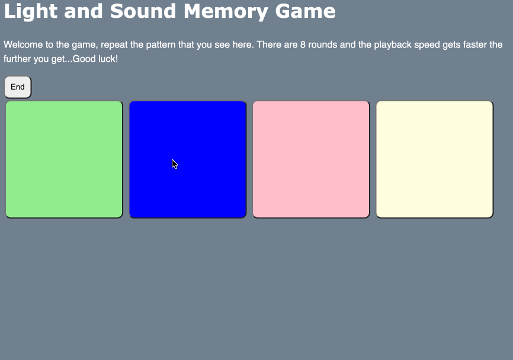
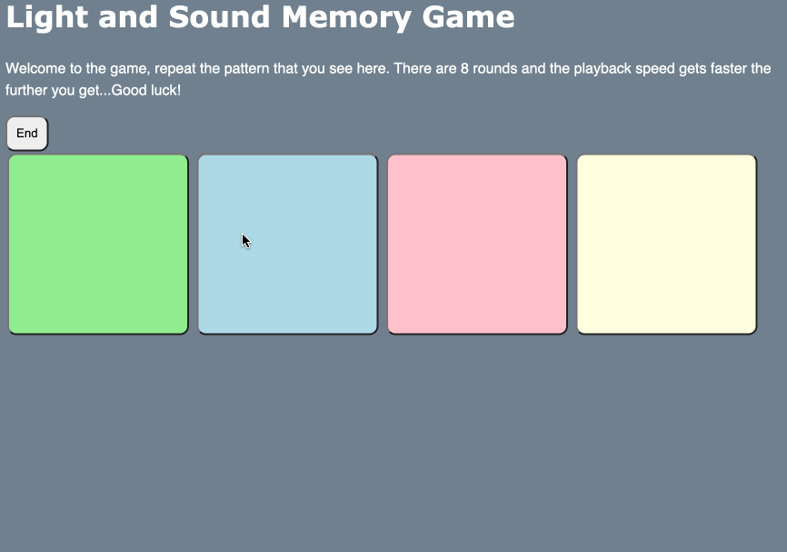

# Pre-work - *Memory Game*

**Memory Game** is a Light & Sound Memory game to apply for CodePath's SITE Program. 

Submitted by: **Kevin Palaquibay**

Time spent: **6** hours spent in total

Link to project: (https://memorize-the-colors.glitch.me)

## Required Functionality

The following **required** functionality is complete:

* [x] Game interface has a heading (h1 tag), a line of body text (p tag), and four buttons that match the demo app
* [x] "Start" button toggles between "Start" and "Stop" when clicked. 
* [x] Game buttons each light up and play a sound when clicked. 
* [x] Computer plays back sequence of clues including sound and visual cue for each button
* [x] Play progresses to the next turn (the user gets the next step in the pattern) after a correct guess. 
* [x] User wins the game after guessing a complete pattern
* [x] User loses the game after an incorrect guess

The following **optional** features are implemented:

* [ ] Any HTML page elements (including game buttons) has been styled differently than in the tutorial
* [ ] Buttons use a pitch (frequency) other than the ones in the tutorial
* [ ] More than 4 functional game buttons
* [x] Playback speeds up on each turn
* [x] Computer picks a different pattern each time the game is played
* [ ] Player only loses after 3 mistakes (instead of on the first mistake)
* [ ] Game button appearance change goes beyond color (e.g. add an image)
* [ ] Game button sound is more complex than a single tone (e.g. an audio file, a chord, a sequence of multiple tones)
* [ ] User has a limited amount of time to enter their guess on each turn

The following **additional** features are implemented:

- [ ] List anything else that you can get done to improve the app!

## Video Walkthrough (GIF)

If you recorded multiple GIFs for all the implemented features, you can add them here:

## Reflection Questions
1. If you used any outside resources to help complete your submission (websites, books, people, etc) list them here. 
[None (Strictly Videos provided)]

2. What was a challenge you encountered in creating this submission (be specific)? How did you overcome it? (recommended 200 - 400 words) 
[One of the main challenges I encountered was trying to debug the game. When trying to do the optional features I tried to implement them by trying to add in code I felt needed to be into certain functions and seeing if I get the result I wanted. When I had to figure out which were to change the const ClueHoldTime I changed the time in different areas in order to reduce the playback time. When playing the game it worked fine but when playing another game right after the change in playback time stayed for the next playthrough in the same session. This resulted in the playback speed being very short at the beginning of a new round. Since I subtracted the playback time whenever the progress increases, with this bug for the new playthrough it thinks we start at round “9” and the playback time goes into the negative which should not exist. This caused the buttons to flash instantly and no sound would come out since the playback time was instantaneous. In order to fix this, I tried to change the ClueHoldTime variable in the playClueSequence function back to 1000 but that resulted in sound being played back in the original time. What fixed this issue was setting the ClueHoldTime back to 1000 in the startGame function so that the sound playback time doesn’t get passed over from the previous time. Another fix could possibly be setting the ClueHold time back to 1000 at the end of the playClueSequence function instead of having to change another function altogether.]

3. What questions about web development do you have after completing your submission? (recommended 100 - 300 words) 
[A question on web development I would ask is how are other languages (Such as C++/Python) implemented into web development / can you? I am aware that C++/Python are back-end languages and javascript can be both but I am curious as to if you can translate the same functions to python for easier use. Also, how would you divide up the work within a team for a project since sometimes you have to collaborate with others for a big project? Is it expected to know the basics of many programming languages or just have a specific language to be specialized at since for this game we used the basics of Html+Css+Javascript?
]

4. If you had a few more hours to work on this project, what would you spend them doing (for example: refactoring certain functions, adding additional features, etc). Be specific. (recommended 100 - 300 words) 
[I would most likely work on the guess count feature. I didn’t know how to go about the “lives” feature (up to 3 guesses before a game over), does getting a wrong guess cause the sequence to play back up to your current progress level? Maybe I could make it so that a for loop is automatically played up to your current progress without the sped-up feature or I could just make it so there is no playback and 1 life/guess is taken for every wrong guess. I would also work on some end cases/forced delays. I would also like to make it so that while the sound playback is happening you are not allowed to click the buttons since this interrupts the sounds and entire playback. When you click a button and the playback is happening the audio cuts off (at least in my case) and then no sound plays back for the rest of the playback. Then whatever button you clicked is considered part of your guess so you may get a game over by accident or you continue from there.]

## Interview Recording URL Link

[My 5-minute Interview Recording](https://youtu.be/jFuI9QztqqE)

## License

    Copyright [YOUR NAME]

    Licensed under the Apache License, Version 2.0 (the "License");
    you may not use this file except in compliance with the License.
    You may obtain a copy of the License at

        http://www.apache.org/licenses/LICENSE-2.0

    Unless required by applicable law or agreed to in writing, software
    distributed under the License is distributed on an "AS IS" BASIS,
    WITHOUT WARRANTIES OR CONDITIONS OF ANY KIND, either express or implied.
    See the License for the specific language governing permissions and
    limitations under the License.
